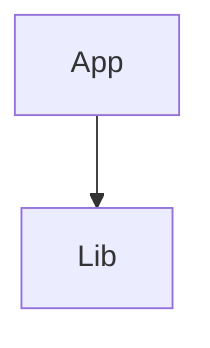

# Upgrade assessment — All.sln

- Tool: [dotnet-upgrade-scan](https://github.com/vericodex/dotnet-upgrade-scan) 1.2.3-test
- Rules: abcdef123456
- Target: net10.0

## Summary

| Project | Target framework | Style | Type | Tier | Blockers | Packages | Effort |
|---|---|---|---|---|---:|---:|---|
| Lib | net472 | Legacy | Library | Syntactic | 0 | 1 | S |
| App | net472 | Legacy | AspNetMvc | Syntactic | 2 | 2 | M |

## Upgrade order

1. Lib
2. App



## Lib

Effort: S (score 0)

### Packages

| Package | Version | Verdict | Replacement | Rule |
|---|---|---|---|---|
| Newtonsoft.Json | 13.0.1 | Compatible | — | PKG0001 |

## App

Effort: M (score 26)

### API findings

**web**

- [API0101] ~ System.Web — Controllers/HomeController.cs:2 — No modern equivalent; requires migration to ASP.NET Core.
- [API0102] ~ System.Web.HttpContext.Current — Controllers/HomeController.cs:12

### Packages

| Package | Version | Verdict | Replacement | Rule |
|---|---|---|---|---|
| System.Data.SqlClient | 4.8.5 | Replace | Microsoft.Data.SqlClient | PKG0002 |
| EntityFramework | 6.4.4 | Partial | Microsoft.EntityFrameworkCore | PKG0003 |

## Effort formula

```
score = Σ (blocker findings per category × category weight)
      + incompatible packages with no known replacement × noReplacement weight
      + incompatible packages with a known replacement × withReplacement weight
floors: configured project types → XL; VB → one size up
```

Weights and bands live in rules/scoring.yaml; the rules hash above pins them.

## Diagnostics

- UPS0001 App: design-time build failed; degrading to manifest analysis.

---

Generated by [dotnet-upgrade-scan](https://github.com/vericodex/dotnet-upgrade-scan) 1.2.3-test — free, open source, and fully offline: no telemetry, no network calls, nothing leaves the machine it runs on.

Effort bands are heuristic. They describe the shape of the problem, not the cost of solving it — a blocker count is not a schedule, and this report does not estimate duration, team size, or budget.

For a costed, sequenced migration plan — blockers triaged, risks named, and a person accountable for the number — talk to Vericodex: [vericodex.com/contact](https://vericodex.com/contact)
